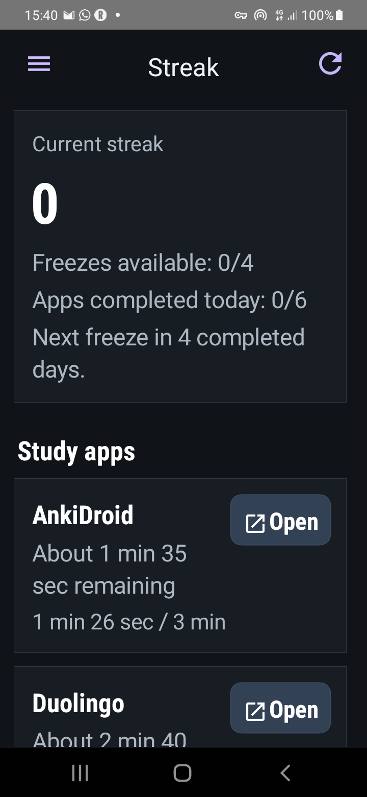
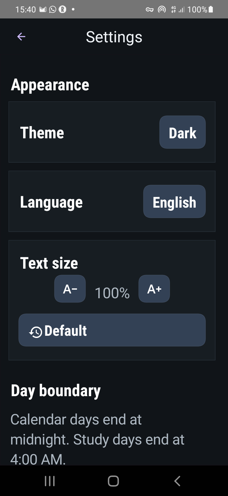
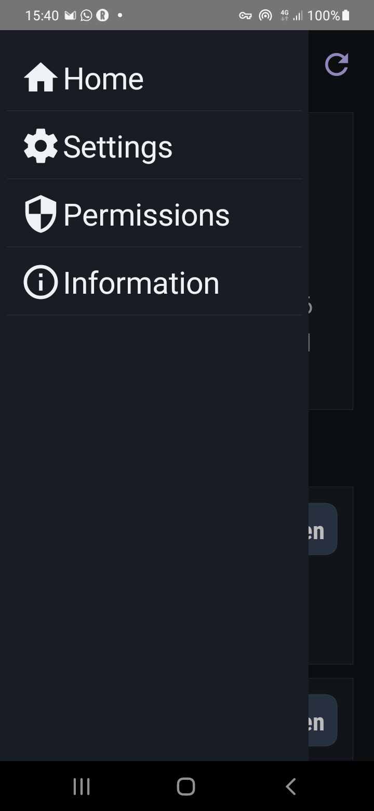
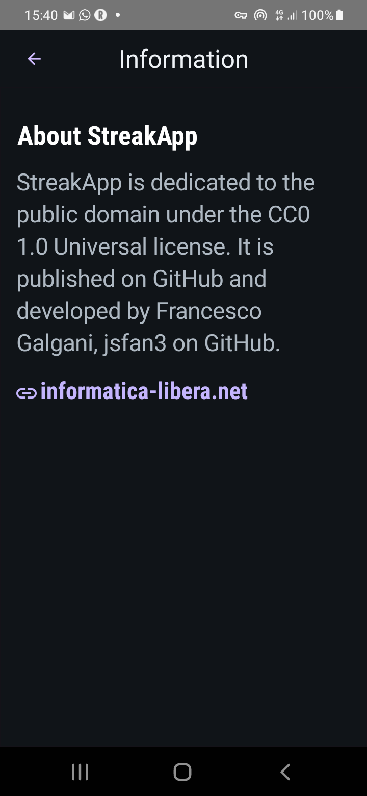

# StreakApp

StreakApp is a small Codename One app for tracking daily language-study streaks
from real Android app usage. It reads Android Usage Access statistics locally,
checks whether the configured study apps reached their daily target, and keeps a
simple streak with limited streak freezes.

## Features

- Tracks usage time for AnkiDroid, Duolingo, Drops, Rosetta Stone, Talkpal, and
  Quizlet.
- Lets each app be enabled or disabled and gives each app an editable daily
  minute target.
- Supports calendar days ending at midnight or study days ending at 4:00 AM.
- Awards one streak freeze every four completed days, capped at four available
  freezes.
- Opens the tracked Android apps directly from the dashboard.
- Refreshes usage asynchronously and refreshes again when the app returns to the
  foreground.
- Supports English and Italian localization. Additional localizations can be
  added fairly easily.
- Supports system, light, and dark appearance modes.
- Supports in-app text size adjustment on top of the device text settings.

## Usage Time Semantics

StreakApp reports the time an Android app remains in the foreground, not the
strict amount of active study time inside that app. Android's usage statistics
include the time spent while the app is launching and visible. On an older
phone, for example, a language app that takes twenty seconds to start can add
those twenty seconds to the foreground total.

For this reason, the daily minute target for each app is editable. You can tune
the target to account for launch time and other foreground time that is not
actual study.

## Screenshots

| Dashboard | Settings |
| --- | --- |
|  |  |

| Navigation | Information |
| --- | --- |
|  |  |

## Android Permission

Usage tracking requires Android's Usage Access permission for StreakApp. The app
does not request a normal runtime permission dialog because Android exposes this
permission through system settings.

All usage calculations happen on the device. StreakApp does not send usage data
to a server.

## License

StreakApp is dedicated to the public domain under the CC0 1.0 Universal
license. See [LICENSE](LICENSE).

## Development

This is a Java 17 Codename One project generated with the Codename One
Initializr.

Useful commands:

```bash
./mvnw -pl common compile cn1:compliance-check
./mvnw -pl common cn1:run
./mvnw -pl common cn1:test
./mvnw -pl android -am package -Dcodename1.platform=android -Dcodename1.buildTarget=android-device
```

Automated Codename One cloud builds require account credentials or a configured
user token. Android signing material should be supplied locally or through CI
secrets and must not be committed.

## Repository Notes

Generated build outputs, APK/AAB files, keystores, provisioning files, local
properties, and environment files are ignored by `.gitignore`.
